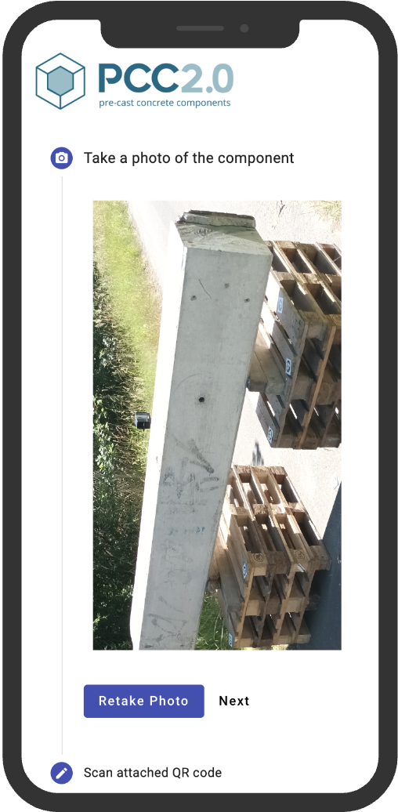
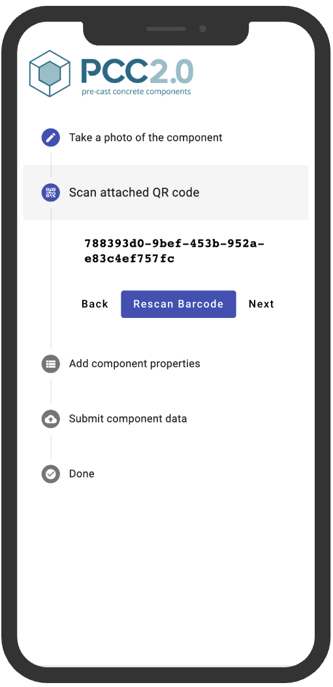
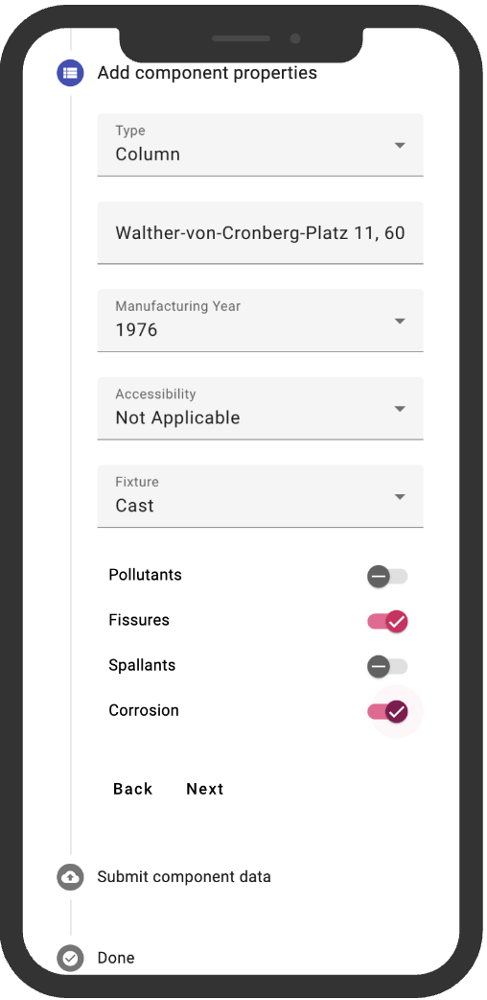
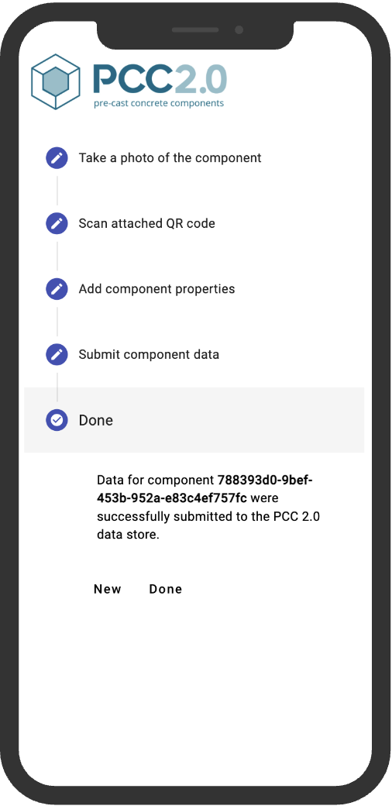

# UI for Component Registration in Concrete Components (CC20)

## Background

This project contains Angular components for the registration process of concrete components for circular reuse of the same.

The code was created as part of the research project "Fertigteil 2.0 - Real-digitale Prozessketten zur Gewinnung von eingebauten Betonbauteilen
für die Weiterverwendung als fertige Bauteile" (033R255) funded bei the Bundesministerium für Bildung und Forschung, Bundesrepublik Deutschland.

## Screenshots

### Photo

### QR Code Scan

### Component Properties

### Submit

## Development and Build

### Development server

Run `ng serve` for a dev server. Navigate to `http://localhost:4200/`. The application will automatically reload if you change any of the source files.

### Code scaffolding

Run `ng generate component component-name` to generate a new component. You can also use `ng generate directive|pipe|service|class|guard|interface|enum|module`.

### Build

Run `ng build` to build the project. The build artifacts will be stored in the `dist/` directory.

### #Running unit tests

Run `ng test` to execute the unit tests via [Karma](https://karma-runner.github.io).

### Running end-to-end tests

Run `ng e2e` to execute the end-to-end tests via a platform of your choice. To use this command, you need to first add a package that implements end-to-end testing capabilities.

### Further help

To get more help on the Angular CLI use `ng help` or go check out the [Angular CLI Overview and Command Reference](https://angular.io/cli) page.
